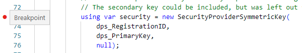

<h1>Hands-On Lab</h1>

<h2>Configure the Device Provisioning Service (DPS)</h2>
<table>
<tr>
<td width="25%" valign="top"> This exercise will enable Azure's DPS to automatically register the device when its initially started.</td>
<td>

 

</td>
</tr>
</table>

<h3>Configure the Device's Registration</h3>
<ol>
  <li>Open the Azure portal by navigating to <a href="https://portal.azure.com">https://portal.azure.com</a>
  <li>Locate the <b>Resource Group</b> that was created in the <b><a href="prerequisites.md">Prerequisites</a></b>
  <li>Open the <b>Device Provisioning Service (DPS)</b> with the name that starts <b>IoT-LevelUp-DPS</b>
  <li>Select the <b>Linked IoT Hubs</b> in the left panel and note that there are no associated IoT Hubs
  <li>Click the <b>+Add</b> at the top of the window
  <li>In the <b>IoT Hub</b> dropdown list, select the hub with the name that starts <b>IoT-LevelUp-Hub</b>
  <li>Click the <b>Save</b> button at the bottom of the panel
  <li>Select the <b>Manage Enrollments</b> in the left panel
  <li>Click the <b>+Add Individual Enrollment</b> at the top of the window
  <li>For <b>Mechanism</b>, select <b>Symmetric Key</b>
  <li>In the <bRegistration ID</b> textbox, enter <b>SimulatedDeviceRegistration</b>
  <li>In the <b>IoT Hub Device ID</b> textbox, enter <b>SimulatedDevice</b>
  <li>In the <b>Initial Device Twin State</b>, replace with the following:
<pre><code class="lang-azurecli">
{
  "tags": {},
  "properties": {
    "desired": {"IntervalFrequency": 5}
  }
}
</pre></code>
  <li>Click the <b>Save</b> button at the top of the window
</ol>

<h3>Get the Primary Key for the Device Enrollment</h3>
<ol>
  <li>Select the <b>Individual Enrollments</b> tab towards the top of the panel
  <li>Select the <b>SimulatedDeviceRegistration</b> registration
  <li>Copy the <b>Primary Key</b> by clicking the blue <b>Copy</b> icon to the right of the entry and save for later reference, titled <b>DPS Primary Key</b>
</ol>

<h3>Prepare Code for an IoT Device</h3>
<ol>
  <li>Open a command prompt by searching for <b>cmd</b> from the Windows Search or Start menu
  <li>Enter the following the download the sample code & launch Visual Studio Code:
<pre><code class="lang-azurecli">
cd\
git clone https://github.com/glbwell0/IoT-LevelUp-Code
cd\IoT-LevelUp-Code
dotnet restore .
code .
</pre></code>
</ol>
<h3>Prepare the Code</h3>
<ol>
  <li>Select the <b>Program.cs</b> file in the Explorer panel on the left
  <li>Enter the <b>Scope ID</b> in line 27 between the double quotes
  <li>Enter the <b>DPS Primary Key</b> in line 29 between the double quotes
  <li>If Visual Studio Code asks to add required assets, click <b>Yes</b>
  <li>Press <i>Ctrl</i>-<b>S</b> to save your updates
  <li>Set a <b>Breakpoint</b> on line <b>73</b> by clicking just to the left of the line number
 
  <li>Set additional breakpoints on code lines <b>151</b> and <b>174</b>
</ol>
<h3>Run the Code</h3>
<ol>
  <li>Press <b>F5</b> to start debugging the simulator
  <li>The code will stop for observation at the start os the <b>ProvisionIoTDevice</b> function
  <li>Walk the code line-by-line by pressing <b>F10</b> until line <b>102</b>, pause here
  <li>Select the <b>DEBUG CONSOLE</b> at the bottom of the window <i>(If the Debug Console is not visible, press <i>Ctrl</i>-<i>Shift</i>-<b>Y</b> to toggle it on/off)</i>
  <li>Copy the Connection String from the Debug Console and save for later reference
  <li>Press <b>F5</b> to continue running the application
  <li>Return to the Azure portal and locate the hub with a name starting with <b>IoT-LevelUp-Hub</b>
  <li>Select <b>Devices</b> in the left panel and the new device should be listed
     If not, click the <b>Refresh</b> button at the top of the window 
 </ol>
 <h3>Monitor the Incoming Telemetry from the Device</h3>
 <ol>
  <li>Launch the <b>Azure IoT Explorer</b> <i>(you can search for <b>iot</b> in Windows Search to quickly find it)</i>
  <li>Select the IoT Hub that starts with <b>IoT-LevelUp-Hub</b>
  <li>Select <b>Simulated Device</b> from the device list
  <li>Select the <b>Telemetry</b> panel on the left
  <li>Click the <b>Start</b> button at the top of the window
  <li>Within about 10 seconds, you should see telemetry flowing about every 5 seconds
 </ol>
 <h3>Manage the Device from the Cloud</h3>
 <ol>
  <li>From the Azure IoT Explorer, select the <b>Device Twin</b> panel on the left
  <li>Locate the <b>IntervalFrequency</b> setting under <b>Properties</b>-<b>Desired</b>
  <li>Change the setting from <b>5</b> to <b>1</b>
  <li>Click <b>Save</b> at the top of the window
  <li>Return to <b>Visual Studio Code</b>
  <li>Note the code has stopped in the <b>OnDesiredPropertyChanged</b> function
  <li>Walk the code by pressing <b>F10</b> for each line until you reach the end of the function at line <b>167</b>
  <li>Remove the breakpoint from line <b>151</b> by clicking the red dot to the left of the line number
  <li>Press <b>F5</b> to continue running the code
  <li>Return to the <b>Azure IoT Explorer</b>
  <li>Click the <b>Refresh</b> button at the top of the <b>Device Twin</b> window
  <li>Note that the <b>IntervalFrequency</b> under the <b>ReportedProperties</b> has updated to <b>1</b>
  <li>Switch to the <b>Telemetry</b> window & press the <b>Start</b> button if it's not already running
  <li>Note the telemetry is now streaming at a rate of about once a second
  <li>Select the <b>Direct Method</b> panel on the left
  <li>Type <b>reset</b> in the textbox under <b>Method name</b> <i>(must be all lowercase)</i>
  <li>Click the <b>Invoke Method</b> located at the top of the window
  <li>Return to <b>Visual Studio Code</b> and note the debugger stopped in the <b>ResetMethod</b> function
  <li>Remove the breakpoint by clicking the red dot next to the line number
  <li>Press <b>F5</b> to continue running the code
  <li>Return to the <b>Azure IoT Explorer</b>
  <li>Note there is an error indicating that the direct method failed 
This is because we paused the code and the device did not acknowledge the call within 30 seconds
  <li>Click the <b>Invoke Method</b> located at the top of the window again & note you receive a successful response
</ol>
<h3> Next Lab</h3>
Next Lab: <a href="RaspberryPiSimulator.md">Demonstrate the IoT Hub with an Online RaspberryPi Simulator</a>
   
