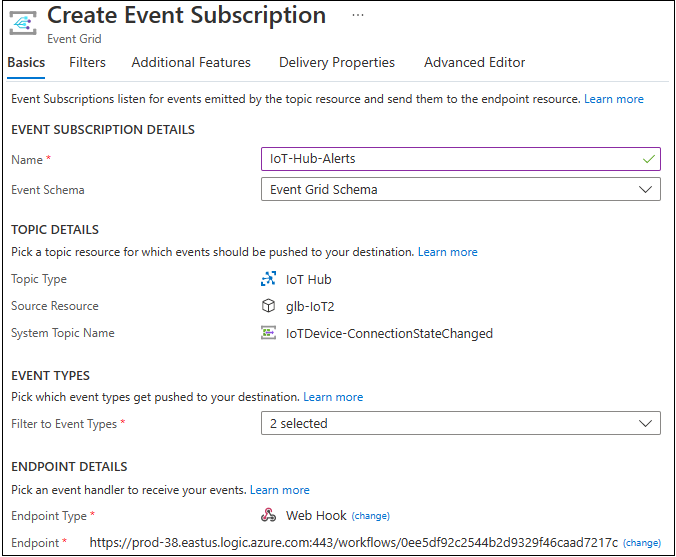

<h1>Hands-On Lab</h1>

<h2>Use Event Grid to Alert for IoT Hub Events</h2>
<table>
<tr>
<td width="20%" valign="top"> This exercise will use Azure Event Grid to trigger an email to notify someone when an IoT device connects or disconnects.</td>
<td>

 

</td>
</tr>
</table>

<h3>Create a Logic App That Sends an Email</h3>
<ol>
  <li>In the Azure portal, open the <b>Resource Group</b> with the title that starts with <b>IoT-LevelUp</b>
  <li>At the top of the window, click <b>Create</b> and search for <b>Logic App</b>
  <li>Click the tile titled <b>Logic App</b> by <b>Microsoft</b>
  <li>Click the <b>Create</b> button
  <li>Enter the following details:
    <ul>
      <li><b>Resource Group:</b> Select the <b>Resource Group</b> with the title starting <b>IoT-LevelUp</b>
      <li><b>Logic App Name:</b> IoTDeviceConnectionAlert-<i>your initials</i>  (this must be a unique name across Azure)
      <li><b>Region:</b>  East US (because that is where your IoT Hub is located)
      <li><b>Plan Type:</b> Consumption
    </ul>
  <li>Click <b>Review + Create</b>, and then click <b>Create</b>
  <li>Once the resource is created, select <b>Go to resource</b>
  <li>In the left side panel, select <b>Logic app designer</b>
  <li>Under <b>Start with a common trigger</b> click <b>When a HTTP request is received</b>
  <li>Click the <b>Use sample payload to generate schema</b> link and enter the following:
    <pre><code class="lang-azurecli" title="JSON">
[{  
 "id": "f6bbf8f4-d365-520d-a878-17bf7238abd8",
 "topic": "/SUBSCRIPTIONS/<azure subscription ID>/RESOURCEGROUPS/<resource group name>/PROVIDERS/MICROSOFT.DEVICES/IOTHUBS/<hub name>",
 "subject": "devices/LogicAppTestDevice",
 "eventType": "Microsoft.Devices.DeviceConnected",
 "eventTime": "2018-06-02T19:17:44.4383997Z",
 "data": {
     "deviceConnectionStateEventInfo": {
       "sequenceNumber":
         "000000000000000001D4132452F67CE200000002000000000000000000000001"
     },
   "hubName": "<hub name>",
   "deviceId": "LogicAppTestDevice",
   "moduleId" : "DeviceModuleID"
 }, 
 "dataVersion": "1",
 "metadataVersion": "1"
}]
 </code></pre>
 <li>Select <b>+ New Step</b>. A window appears, prompting you to <b>Choose an action</b>
 <li>Search for <b>Outlook</b> and select <b>Outlook.com</b>
 <li>Select the <b>Send an email (V2)</b> action.  This will open a window to login to an Outlook.com account <i>(Do not use your corporate account)</i>
 <li>Select <b>Sign in</b> and sign in with the <b>free Outlook email account</b> that you created in the <a href="./prerequisites.md">Prerequisites</a>
 <li>Select <b>Yes</b> to let the app access your info
 <li>Build your email template with the following:
 <ul>
   <li><b>To:</b> Enter your email address (or an account where you want the notification sent)
   <li><b>Subject:</b>
   <ul>
     <li>Type <b>IoT Device Connection Alert:</b>, then click the <b>Add dynamic content</b> link
     <li>Search for <b>eventType</b> and select it
   </ul>
 <li><b>Body:</b> Write the text for your email and include some dynamic content based on event data. If you can't see the Dynamic content, select the <b>Add dynamic content</b> hyperlink under the <b>Body</b> text box. If it doesn't show you the fields you want, click <b>See more</b> in the Dynamic content screen to include the fields from the previous action.
 
 
 <li>Click the <b>Save</b> button at the top of the page
 <li>Return to the first task titled <b>When a HTTP request is received</b> by clicking the box
 <li>Copy the <b>HTTP POST URL</b> by clicking the <b>Copy</b> button to the right of the field
 
 
 <li>Paste this with a title <b>HTTP Post URL</b> for later reference
</ol>
<h3>Create & Configure an Event Grid Subscription for IoT Hub Events</h2>
<ol>
<li>In the Azure portal, navigate to your IoT Hub and select the <b>Events</b> panel

<li>Click the <b>+Event Subscription</b> button and enter the following values:
<ul> 
  <li>In the <b>EVENT SUBSCRIPTION DETAILS</b> section:
  <ul>
    <li>Enter <b>IoT-Hub-Alerts</b> for the <b>Name</b>
    <li>Select <b>Event Grid Schema</b> for </b>Event Schema</b>
  </ul> 
  <li>In the <b>TOPIC DETAILS</b> section:
  <ul>
    <li>Confirm that the <b>Topic Type</b> is set to <b>IoT Hub</b>
    <li>Confirm that your IoT Hub is set as the value for the <b>Source Resource</b> field
    <li>Enter <b>IoTDevice-ConnectionStateChanged</b> for the <b>System Topic Name</b>
  </ul> 
  <li>In the <b>EVENT TYPES</b> section:
  <ul>
    <li>Open the <b>Filter to Event Types</b> dropdown list and select only <b>Device Connected</b> and <b>Device Disconnected</b>
  </ul> 
  <li>In the <b>ENDPOINT DETAILS</b> section:
  <ul>
    <li>Select <b>Endpoint Type</b> as <b>Web Hook</b>
    <li>Click <b>Select an Endpoint</b>, paste the URL that you copied from your logic app, and confirm selection
  </ul>
  </ul>
   
  When you're done, the pane should look like the following example:
    
  
  <li>Click the <b>Create</b> button
</ol>
<h3>Simulate a New Device Connecting and Sending Telemetry</h3>
<ol>
<li>Sign into an Azure CLI by navigating to <a href="https://shell.azure.com">https://shell.azure.com</a>
<li>Run the following command to simulate connecting your device to IoT Hub and sending telemetry:

  <pre><code class="lang-azurecli">az iot device simulate -d SimulatedDevice -n <i>{YourIoTHubName}</i>
</code></pre>
<li>When the simulated device connects to IoT Hub, within ~2 minutes you'll receive an email notifying you of a <b>"DeviceConnected"</b> event
<li>Enter <b><i>Ctrl</i>-C</b> to cancel the simulation, you'll receive an email notifying you of a <b>"DeviceDisconnected"</b> event
</ol>
 
<b>Congrats!!!  You're All Done!</b>

You can now return to the <a href="README.md">Main Lab Screen</a>
