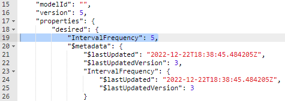
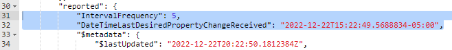

<h1>Hands-On Lab</h1>

<h2>Simulatate an IoT Device with C# Code</h2>
<table>
<tr>
<td width="25%" valign="top"> During this exercise you will develop code to simulate a device communicating with your Azure IoT Hub.</td>
<td>

 

</td>
</tr>
</table>

<h3>Get the Simulated Device Code from GitHub</h3>
<ol>
  <li>Open a command prompt by searching for <b>cmd</b>
  <li>Navigate to your root directory by typing <b>cd\</b>
  <li>Enter the following the download the sample code:
<pre><code class="lang-azurecli" title="JSON">
git clone https://github.com/glbwell0/IoT-LevelUp-Code
</pre></code>
  <li>Change to the working directory by entering the following:
<pre><code class="lang-azurecli" title="JSON">
cd\IoT-LevelUp-Code
</pre></code>
</ol>
<h3>Prepare the Code</h3>
<ol>
  <li>Add the <b>Azure IoT Device SDK</b> by entering the following 2 commands:
<pre><code class="lang-azurecli" title="JSON">
dotnet add . package Microsoft.Azure.Devices
dotnet restore .
</pre></code>
  <li>Launch Visual Studio Code by entering the following:
<pre><code class="lang-azurecli" title="JSON">
code .
</pre></code>
  <li>Select <b>Program.cs</b> in the left panel
  <li>If you see a prompt stating <b>Required assets to build and debug are missing from 'IoT-LevelUp-Code'.  Add them?</b>, select <b>Yes</b>
  <li>On line 28, paste your <u>Device</u> connection string and press <i>Ctrl</i>-S to save your update
  <li>Set a breakpoint on line <b>33</b> by clicking just to the left of the line number

  <li>Set additional breakpoints for code lines <b>75</b>, <b>106</b> and <b>129</b>
  <li>Press the <b>F5</b> key to start debugging the code
  <li>Walk the code line by line by pressing <b>F10</b> to progress to the next line
  <li>Remove the breakpoint on line <b>75</b> by clicking on the red dot
  <li>Press <b>F5</b> to allow the code to continue running
</ol>
<h3>View the Incoming Telemetry from the IoT Device</h3>
<ol>
  <li>Launch the <b>Azure IoT Explorer</b> by searching for <b>iot</b>
  <li>Select your IoT Hub
  <li>Select your IoT Device from the list
  <li>Select <b>Telemetry</b> from the left panel
  <li>Click the <b>Start</b> button at the top of the window 
    <i>You should see telemetry data appearing</i>
  <li>Click the <b>Stop</b> button at the top of the window
</ol>
<h3>Remotely Control Your Device with its Device Twin</h3>
<ol>
  <li>In the <b>Azure IoT Explorer</b>, select <b>Device Twin</b> in the left pane
  <li>Under the <b>Properties</b> - <b>Desired</b> section, enter the following:
<pre><code class="lang-azurecli" title="JSON">
"IntervalFrequency": 5,
</pre></code>

  <li>Click the <b>Save</b> button
  <li>Return to <b>Visual Studio Code</b> 
  <li>The debugger should have stopped in the <b>OnDesiredPropertyChanged</b> function
  <li>Walk the debugger by pressing <b>F10</b> for each line of code
  <li>When you reach the end of the function (line 122), press <b>F5</b> to continue running the program
  <li>Return the the <b>Azure IoT Explorer</b>
  <li>On the <b>Device Twin</b> window, click the <b>Refresh</b> button at the top
  <li>Notice the <b>IntervalFrequency</b> and the <b>DateTimeLastDesiredPropertyChangeReceived</b> properties have been updated in the <b>Properties</b> - <b>Reported</b> section
    

    </ol>
<h3>Remotely Send a Command to the IoT Device</h3>
<ol>
  <li>In the <b>Azure IoT Explorer</b>, select <b>Direct Method</b> in the left pane
  <li>Just under <b>Method Name</b> enter <b>reset</b> in the text box -<i>note: it must be all lowercase</i>
  <li>Click the <b>Invoke Method</b> link at the top of the window
  <li>Return to <b>Visual Studio Code</b> 
  <li>The debugger should have stopped in the <b>ResetMethod</b> function
  <li>Walk the debugger by pressing <b>F10</b> for the next 2 lines of code
  <li>When you reach the end of the function (line 131), remove the breakpoint and press <b>F5</b> to continue running the program
  <li>Return the the <b>Azure IoT Explorer</b>
  <li>You likely received an error stating the method call failed -this is because our code did not respond within 30 seconds
  <li>Click the <b>Invoke Method</b> link at the top of the window again and note that it successfully completed
</ol>
  
  You can now return to the <a href="README.md">Main Lab Screen</a>
    
