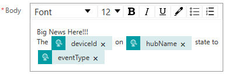
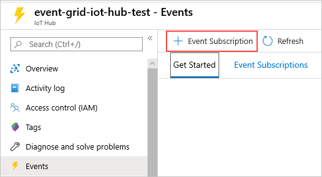

# IoT-LevelUp

Let's get your environment setup with a few <b><a href="prerequisites.md">Prerequisites</a></b>.  This should only take about 10 minutes.

<h1>Hands-On Lab</h1>

<h2>Use Event Grid to Alert for IoT Hub Events</h2>
<table>
<tr>
<td width="20%" valign="top"> This exercise will use Azure Event Grid to trigger an email to notify someone every time an IoT device connects or disconnects.</td>
<td>

 

</td>
</tr>
</table>

<h3>Create a Logic App That Sends an Email</h3>
<ol>
  <li>In the Azure portal, click <b>Create a Resource</b> and search for <b>Logic App</b>
  <li>Click the <b>Create</b> button
  <li>Enter the following details:
    <ul>
      <li><b>Resource Group:</b>  Select the desired resource group
      <li><b>Logic App Name:</b>  IoTDeviceConnectionAlert-<i>your initials</i>  (this must be a unique name across Azure)
      <li><b>Region:</b>  East US (or your preferred region)
      <li><b>Plan Type:</b> Consumption
    </ul>
  <li>Click <b>Review + Create</b>, and then click <b>Create</b>
  <li>Once the resource is created, select <b>Go to resource</b>
  <li>In the left side panel, select <b>Logic app designer</b>
  <li>Under <b>Start with a common trigger</b> click <b>When a HTTP request is received</b>
  <li>Click the <b>Use sample payload to generate schema</b> link and enter the following:
    <pre><code class="lang-azurecli" title="JSON">
[{  
 "id": "f6bbf8f4-d365-520d-a878-17bf7238abd8",
 "topic": "/SUBSCRIPTIONS/<azure subscription ID>/RESOURCEGROUPS/<resource group name>/PROVIDERS/MICROSOFT.DEVICES/IOTHUBS/<hub name>",
 "subject": "devices/LogicAppTestDevice",
 "eventType": "Microsoft.Devices.DeviceConnected",
 "eventTime": "2018-06-02T19:17:44.4383997Z",
 "data": {
     "deviceConnectionStateEventInfo": {
       "sequenceNumber":
         "000000000000000001D4132452F67CE200000002000000000000000000000001"
     },
   "hubName": "<hub name>",
   "deviceId": "LogicAppTestDevice",
   "moduleId" : "DeviceModuleID"
 }, 
 "dataVersion": "1",
 "metadataVersion": "1"
}]
 </code></pre>
 <li>Select <b>+ New Step</b>. A window appears, prompting you to <b>Choose an action</b>
 <li>Search for <b>Outlook</b> and select <b>Outlook.com</b>
 <li>Select the <b>Send an email (V2)</b> action.  This will open a window to login to your account
 <li>Select <b>Sign in</b> and sign in to your email account. Select <b>Yes</b> to let the app access your info
 <li>Build your email template with the following:
 <ul>
   <li><b>To:</b> Enter your email address (or an account where you want the notification sent)
   <li><b>Subject:</b>
   <ul>
     <li>Type <b>IoT Device Connection Alert:</b>, then click the <b>Add dynamic content</b> link
     <li>Search for <b>eventType</b> and select it
   </ul>
 <li><b>Body:</b> Write the text for your email and include some dynamic content based on event data. If you can't see the Dynamic content, select the <b>Add dynamic content</b> hyperlink under the <b>Body</b> text box. If it doesn't show you the fields you want, click more in the Dynamic content screen to include the fields from the previous action.
 
 
 
 <li>Return to the first task titled <b>When a HTTP request is received</b> by clicking the box
 <li>Copy the <b>HTTP POST URL</b>.  We're going to use this when configuring the Event Grid.
 
 
 
</ol>
<h2>Create & Configure an Event Grid Subscription for IoT Hub Events</h2>
<ol>
<li>In the Azure portal, navigate to your IoT Hub and select the <b>Events</b> panel

