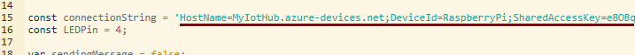

<h1>Hands-On Lab</h1>

<h2>Demonstrate the IoT Hub with an online RaspberryPi Simulator</h2>
<table>
<tr>
<td width="25%" valign="top"> This exercise will use an online RaspberryPi simulator to send telemetry to an Azure IoT Hub.  This is a faster and simplier approach to demonstrate our IoT platform.</td>
<td>

 

</td>
</tr>
</table>

<h3>Load Azure IoT Explorer to Monitor for Telemetry</h3>
<ol>
  <li>If the <b>Azure IoT Explorer</b> is not already running
  <ul>
    <li>Launch the Azure IoT Explorer you installed from the <b><a href="prerequisites.md">Prerequisites</a></b>
    <li>Click the device titled <b>SimulatedDevice</b>
  </ul>
  <li>In panel on the left, select <b>Telemetry</b>
  <li>Click the <b>Clear Events</b> button at the top of the window
  <li>Click the <b>Start</b> button at the top 
    Note:  There will not be any telemetry appearing  ...yet.
</ol>

  <h3>Send Telemetry with the RaspberryPi Simulator</h3>
<ol>
  <li><b><i>Ctrl</b></i>-Click <a href="https://azure-samples.github.io/raspberry-pi-web-simulator/#getstarted">here</a> to launch the <b>RaspberryPi Simulator</b>
  <li>Copy your <u>device</u> connection string into the code on line 15 between the single quotes 

  <li>Click the <b>Run</b> link located just below the code window
  <li>Return to the <b>Azure IoT Explorer</b> and watch the telemetry stream
  <li>Stop monitoring the telemetry by clicking the <b>Stop</b> button at the top
  <li>Return to the <b>RaspberryPi Simulator</b> and click the <b>Stop</b> link located just below the code window
</ol>
<h3>Next Lab</h3>
Next Lab: <a href="EventGridAlert.md">Use Event Grid to Alert for IoT Hub Events</a>
