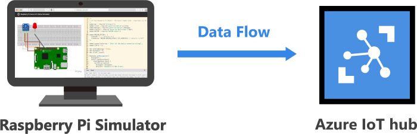

<h1>Hands-On Lab</h1>

<h2>Demonstrate the IoT Hub with an online RaspberryPi Simulator</h2>
<table>
<tr>
<td width="25%" valign="top"> This exercise will use an online RaspberryPi simulator to send telemetry to an Azure IoT Hub.</td>
<td>

 

</td>
</tr>
</table>

<ol>
  <li>Launch the Azure IoT Explorer you installed from the Pre
  <li><b><i>Ctrl</b></i>-Click <a href="https://azure-samples.github.io/raspberry-pi-web-simulator/#getstarted">here</a> to launch the RaspberryPi Simulator
  <li>Copy your <u>device</u> connection string into the code on line 15
    
