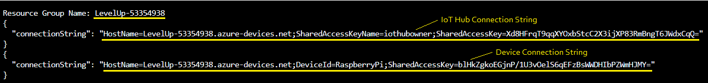

<h1>Prerequisites</h1>

<h3>Create a new Resource Group with an IoT Hub</h3>
<ol>
<li>Sign into an Azure CLI by navigating to <a href="https://shell.azure.com" target="_blank">https://shell.azure.com</a>

<li>Run the following script:
 This will take about 5 minutes to complete
<pre><code class="lang-azurecli">
# IoT LevelUp
az extension update --name azure-iot
az provider register --namespace 'Microsoft.EventGrid'

let "randomIdentifier=$RANDOM*$RANDOM"
location="East US"
resourceGroup="LevelUp-$randomIdentifier"
iotHubName="LevelUp-$randomIdentifier"
deviceID="RaspberryPi"

az group create --name $resourceGroup --location "$location"
az iot hub create --name $iotHubName --resource-group $resourceGroup --sku S1 
az iot hub device-identity create -n $iotHubName -d RaspberryPi

echo "Resource Group Name: $resourceGroup"
az iot hub connection-string show -n $iotHubName --policy-name iothubowner
az iot hub device-identity connection-string show --hub-name $iotHubName --device-id RaspberryPi
</pre></code>
  <li>Copy the <b>Resource Group Name</b>, <b>IoT Hub Connection String</b> and <b>IoT Device Connection String</b> for later reference
    
   
<h3>Install Visual Studio Code</h3>
<ol>
  <li><i>Ctrl</i>-Click <a href="https://code.visualstudio.com/Download">here</a> to navigate to the Visual Studio Code download page
  <li>Select the blue button of the appropriate operating system (i.e. Windows)
  <li>Open the downloaded setup file from your <b>Downloads</b> folder
  <li>Walk through the setup wizard, selecting all the default options
</ol>
 
<h3>Install the Azure IoT Explorer</h3>
<ol>
<li>Click <a href="https://github.com/Azure/azure-iot-explorer/releases/download/v0.15.4/Azure.IoT.Explorer.Preview.0.15.4.msi">here</a> to download and install.
<li>Launch the application if it does not automatically start
<li>Click the <b>+ Add Connection</b> button
<li>Paste your IoT Hub's connection string and click the <b>Save</b> button
</ol>

That's all -You're ready to go!!!

  <a href="README.md"><b>Return to the Hands-on Lab<b></a>
